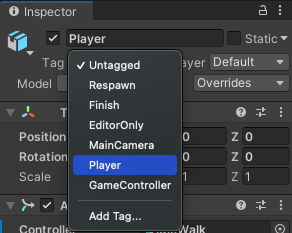

Dans Unity, un Tag peut être appliqué à un ou plusieurs GameObjects afin qu'ils puissent être facilement identifiés.

The Player tag is included in Unity.

Select a GameObject and set the Tag to `Player` using the drop-down menu in the Inspector:

Tu peux aussi ajouter des tags.

Choose any GameObject.

**Tip:** **Add Tag** only creates a new tag, it does not apply it to the GameObject you selected.

To apply a tag to a GameObject, select the GameObject and click on the tag drop-down menu and choose **Add Tag...** and give your tag a name.

**Tip:** You can select multiple GameObjects using <kbd>Shift</kbd> or <kbd>Ctrl</kbd> and then clicking on them. If you set the tag in the Inspector with multiple GameObjects selected, then the tag will be applied to all of the selected GameObjects. 
